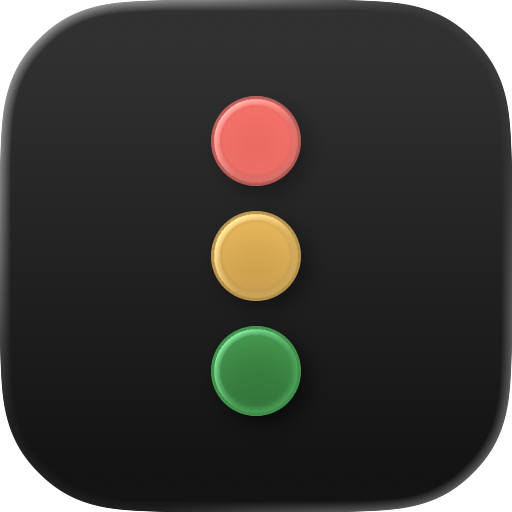
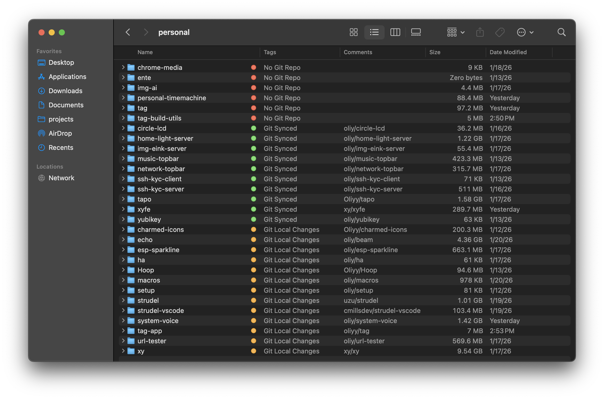
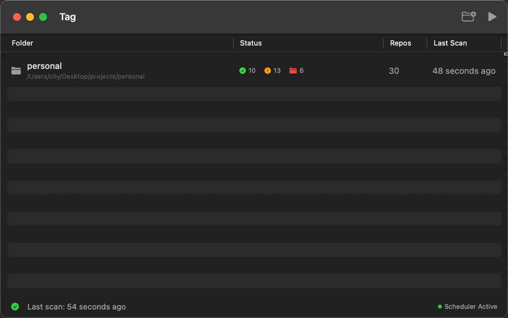

	  
	  <h1><b>Tag</b></h1>
	  
Automatically tag your folders by Git status 
	  <a href="#how-it-works"><strong>Get started »</strong></a>  
	  <a href="https://github.com/MonotonicLabs/tag/releases">Download for macOS</a> 
	  <i>~ Compatible with macOS 15 and later. ~</i>

	

**Tag is a macOS app that applies Finder tags to folders based on their Git status.**

- Automatically keeps tags up to date in the background ⏱️
- Customize Tag colors and names 🏷️
- Display Git origin as a comment ☁️
- Customize the sync schedule 🔄
- Selectively enable or disable different types of tags ⚙️

  

 

## How it works
You select one or more “root” folders (for example `~/projects`). Tag scans each *direct child* folder and:

- Detects whether it’s a Git repo
- Checks for uncommitted changes and unpushed commits
- Applies a configurable Finder tag (name + color)
- Optionally writes `owner/repo` as the Finder comment (requires macOS Automation permission for Finder)

 

## Build & Test

- Open `tag.xcodeproj` in Xcode and run the `tag` scheme.
- Or use the Makefile:
  - `make build`
  - `make test`
  - `make test-integration`

For CI runners (or local machines without signing set up), disable code signing:

- `make test CI=1`
- `make test-integration CI=1`

 

## Permissions

- **Finder Automation**: needed if “Write Finder comment from git origin” is enabled.
- **Terminal Automation**: only needed if you use “Open in Terminal”.

macOS will prompt the first time; you can manage this in System Settings → Privacy & Security → Automation.

 

## Background Scheduler (LaunchAgent)

Tag can install a per-user LaunchAgent to run periodic scans (default: every 5 minutes). The scheduler runs the app executable with `--run-once` and persists scan results so the UI can show the most recent scan on next launch.

The LaunchAgent and logs live under your home directory:

- `~/Library/LaunchAgents/`
- `~/Library/Logs/`

 

## Data & Privacy

### What’s stored locally (and where)

Per-user config + scan state:

- `~/Library/Application Support/com.monotonic.tag/config.json` (selected roots, tag settings, schedule, etc.)
- `~/Library/Application Support/com.monotonic.tag/scan-history.json` (last scan results/statuses; may include derived `owner/repo` strings from git remotes for display)
- `~/Library/Application Support/com.monotonic.tag/scan-progress.json` (in-progress scan status)

If you enable the background scheduler (LaunchAgent), it also writes:

- `~/Library/LaunchAgents/com.monotonic.tag.scheduler.plist`
- `~/Library/Logs/com.monotonic.tag/scheduler.out.log`
- `~/Library/Logs/com.monotonic.tag/scheduler.err.log`

On the folders you scan, Tag modifies Finder metadata (Finder tags and optionally Finder comments).

### Network & Tracking

**No tracking:** Tag does not collect analytics/telemetry.

**No network:** Tag does not make outbound network requests (no HTTP clients or webviews). The only external commands it runs are local binaries like `git` (to read repo status) and `launchctl` (to manage the optional LaunchAgent).

### Sandbox

Tag is currently **not sandboxed** (`ENABLE_APP_SANDBOX = NO` in `tag.xcodeproj`). Tag is designed to only operate on folders you explicitly select, but you should treat it like any other non-sandboxed desktop app (review the source, build it yourself, etc).
